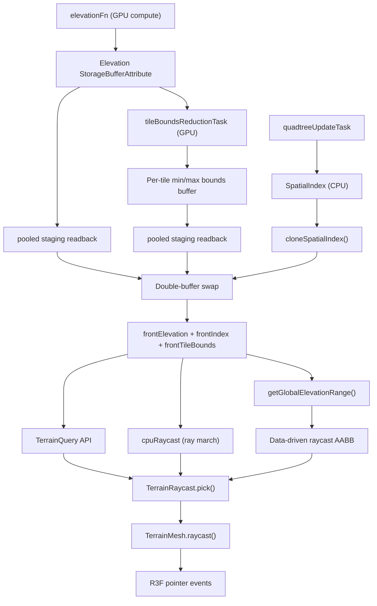

import TileBoundsScene from "@/examples/TileBoundsScene"

## The problem

Terrain elevation lives on the GPU. It's computed by a WebGPU compute shader, stored in a `StorageBufferAttribute`, and never touches JavaScript during normal rendering. But many gameplay and interaction tasks need elevation data on the CPU: placing objects, snapping characters to the ground, responding to mouse clicks.

Evaluating the elevation function a second time on the CPU would duplicate the GPU logic, and the elevation function is user-provided TSL — there is no JavaScript equivalent to call.

The terrain query and raycast systems solve this by reading the GPU elevation data back to the CPU asynchronously, then building a fast lookup cache that answers point queries and ray intersections synchronously.

## Data flow



### Step by step

1. **GPU compute** writes elevation values into a `StorageBufferAttribute`. Each quadtree leaf tile owns a grid of `(innerTileSegments + 3)^2` vertices. The extra border vertices overlap with neighbors, which allows bilinear sampling without cross-tile fetches.

2. **Quadtree update** produces a `LeafSet` and builds a `SpatialIndex` — a CPU-side open-addressed hash map keyed by `(space, level, tileX, tileY)` that maps to the leaf array index.

3. **GPU bounds reduction** runs immediately after the elevation compute. A dedicated compute kernel uses workgroup shared memory to parallel-reduce each tile's elevation grid into a `(min, max)` pair. The output is a compact per-tile bounds buffer on the GPU.

4. **Readback** is triggered by `terrainReadbackTask` once per frame (if no readback is already in flight). It clones the current `SpatialIndex` into a back buffer (skipping the clone if the spatial index hasn't changed since the last readback), then copies the elevation buffer and the small per-tile bounds buffer into the CPU back buffers. Readback reuses a persistent per-attribute staging buffer (`ReadbackSlot`) that is recreated only when the source buffer size changes — it does **not** allocate a new GPU buffer each frame. Only the active region (`activeLeafCount` tiles) is copied and mapped, so cost scales with the number of live tiles rather than the full buffer. The copies are asynchronous and resolve on a later frame. Because readback is a separate fire-and-forget task, downstream consumers like `terrainRaycastTask` don't block on it.

   > A reused staging buffer is important for performance: Three.js' `WebGPURenderer.getArrayBufferAsync` allocates a fresh `_readback` GPU buffer on every call and never destroys it, so calling it every frame leaks GPU memory until garbage collection reclaims it in a large, stuttering batch. The pooled path avoids that entirely. The renderer's `getArrayBufferAsync` is kept only as a fallback when no WebGPU backend/device is available (e.g. in unit tests).

5. **Double-buffer swap** happens when both readback promises resolve. The back elevation array, back spatial index, and back tile bounds become the new front buffers. The global elevation range (min/max across all tiles) is computed from the bounds during the swap. This ensures all data is from the same frame — a consistent snapshot.

6. **TerrainQuery** reads from the front buffers. Point queries (`getElevation`, `sampleTerrain`, etc.) are fully synchronous. Per-tile bounds are available via `getTileBounds()`, and the global elevation range via `getGlobalElevationRange()`.

7. **TerrainRaycast** uses the query for ray marching. Its AABB is derived from the actual global elevation range rather than a conservative estimate, giving tighter clipping. The mesh's `raycast()` override routes Three.js raycaster calls through this system.

## CPU terrain cache

The cache is the core data structure. It holds two sets of buffers (front and back) and exposes sampling methods.

### Tile lookup

Given a world `(x, z)`, the cache finds the containing tile by walking from the finest level (`maxLevel`) down to level 0. At each level it computes the tile grid coordinates and probes the spatial index hash map. The first hit is the most detailed tile covering that point.

```
for level = maxLevel down to 0:
    tileSize = rootSize / 2^level
    tileX = floor((worldX - originX + halfRoot) / tileSize)
    tileY = floor((worldZ - originZ + halfRoot) / tileSize)
    leafIndex = spatialIndex.lookup(space=0, level, tileX, tileY)
    if found: return leafIndex, tileSize, localUV
```

This is O(maxLevel) in the worst case, but the hash lookup at each level is O(1) amortized.

### Bilinear sampling

Once a tile is found, the local UV is converted to grid coordinates and the elevation is bilinearly interpolated from the four surrounding vertices in the flat `Float32Array`:

```
base = leafIndex * verticesPerNode
height = bilinear(frontElevation[base + ...])
scaledHeight = originY + height * elevationScale
```

### Normal computation

Normals are derived via central differences — sampling elevation at `(gx-1, gy)`, `(gx+1, gy)`, `(gx, gy-1)`, `(gx, gy+1)` and computing the cross product of the resulting tangent vectors.

### Batch queries

`sampleTerrainBatch` accepts an interleaved `Float32Array` of `(x, z)` pairs and returns parallel arrays of elevations, normals, and validity flags. It caches the last tile lookup to skip redundant hash probes when consecutive points fall in the same tile.

## CPU raycasting

The ray march algorithm intersects a ray against the terrain heightfield stored in the CPU cache.

### Bounding volume

The terrain is bounded by an axis-aligned box:
- XZ extents: `origin ± rootSize/2`
- Y extents: derived from the GPU-computed per-tile elevation bounds (falls back to `origin.y ± elevationScale * 2` before the first readback)

The per-tile bounds reduction pass computes the true min/max elevation across all active tiles. This means the raycast AABB tightly fits the actual terrain surface rather than using a conservative overestimate. A mostly-flat terrain with `elevationScale = 100` might have a Y range of `[-2, 5]` instead of the old `[-200, 200]`.

The ray is clipped to this AABB. If it misses entirely, the raycast returns `null` immediately.

### Linear march

The clipped ray segment is divided into `maxSteps` (default 128) evenly spaced sample points. At each point, a signed distance is computed:

```
signedDistance = ray.y_at_t - terrainQuery.sampleTerrain(ray.x_at_t, ray.z_at_t).elevation
```

A positive value means the point is above the terrain; negative means below. When the sign flips from positive to negative between consecutive steps, the ray has crossed the terrain surface.

### Binary refinement

Once a sign change is detected between steps `t_prev` and `t_curr`, binary search narrows the interval over `refinementSteps` (default 8) iterations. The final hit position is snapped to the terrain elevation at that XZ to eliminate floating-point drift.

### Fallback chain

`TerrainRaycast.pick()` implements a three-stage fallback:

1. **Precise CPU ray march** — uses the full algorithm above. Returns immediately if it finds a hit.
2. **Bounds-only + elevation refinement** — if the precise march fails but the terrain query is available, a simple ray-plane intersection at the terrain's reference Y gives a coarse XZ hit. That point is then refined with `sampleTerrain` to get the true elevation and normal.
3. **Raw bounds-only** — if no terrain data is available yet (before the first readback completes), the plane intersection provides a rough hit so that pointer events still work during startup.

## TerrainMesh integration

`TerrainMesh` extends `InstancedMesh` and overrides `raycast()`:

```ts
raycast(raycaster, intersects) {
    if (!this.terrainRaycast) {
        super.raycast(raycaster, intersects);
        return;
    }
    const result = this.terrainRaycast.pick(raycaster.ray);
    if (!result) return;
    intersects.push({
        distance: result.distance,
        point: result.position.clone(),
        normal: result.normal.clone(),
        object: this,
    });
}
```

This means standard Three.js raycasting and R3F pointer events (`onPointerMove`, `onPointerDown`, etc.) automatically use terrain-aware picking once `terrainRaycast` is assigned to the mesh. The `event.point` in R3F handlers carries the correct terrain elevation.

## Per-tile bounds reduction

After the elevation field compute, a separate GPU compute kernel reduces each tile's elevation grid to a `(min, max)` pair using workgroup shared memory.

The kernel dispatches one workgroup per active tile. Within each workgroup, threads cooperatively scan the tile's elevation values using a parallel tree reduction. Each thread first pre-reduces its assigned elements (handling tiles with more vertices than the workgroup size), writes to shared memory, then participates in a log2(N) barrier-synchronized reduction. Thread 0 writes the final min/max to a compact per-tile output buffer.

This runs entirely on the GPU in under 0.1ms for typical tile counts. The small output buffer (2 floats per tile) is read back to the CPU alongside the elevation data, adding negligible overhead to the async readback.

The yellow wireframe boxes below visualize the per-tile bounding boxes derived from the GPU reduction pass. Each box spans the tile's XZ footprint and its true min/max elevation.

<div className="h-[560px] rounded overflow-hidden">
  <TileBoundsScene />
</div>

## Task graph wiring

The systems are integrated into the reactive task graph:

- `tileBoundsContextTask` creates the per-tile bounds storage buffer and compiles the reduction kernel.

- `tileBoundsReductionTask` depends on `executeComputeTask` (ensuring elevation is written) and dispatches the reduction kernel. It runs on the GPU lane.

- `terrainQueryTask` depends on `quadtreeConfigTask` and terrain params. It creates and manages the `CpuTerrainCache` and `TerrainQuery` facade. This is a stable "create" task — it only re-runs when configuration changes, not every frame. It does **not** depend on GPU compute tasks, keeping it off the GPU critical path.

- `terrainReadbackTask` depends on `tileBoundsReductionTask`, `terrainQueryTask`, and the leaf GPU state. It triggers readback of both the elevation buffer and the bounds buffer each frame. No downstream tasks depend on it — readback is a fire-and-forget side effect. It runs on the GPU lane.

- `terrainRaycastTask` depends on `terrainQueryTask` (not the readback task). It reads the global elevation range from the query to set its AABB, falling back to a conservative estimate before the first readback completes. Because it depends on the stable query task rather than the per-frame readback, it avoids blocking on GPU compute.

All tasks always return their respective objects (never `null`). The objects handle internal readiness gracefully — queries return `{ valid: false }` before the first readback, and the raycast falls back to bounds-only picking.
