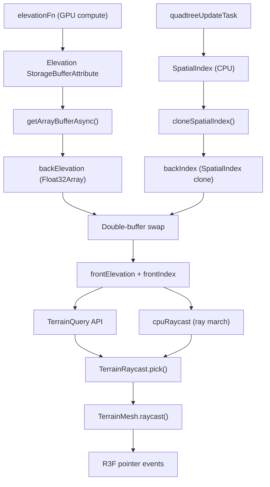

## The problem

Terrain elevation lives on the GPU. It's computed by a WebGPU compute shader, stored in a `StorageBufferAttribute`, and never touches JavaScript during normal rendering. But many gameplay and interaction tasks need elevation data on the CPU: placing objects, snapping characters to the ground, responding to mouse clicks.

Evaluating the elevation function a second time on the CPU would duplicate the GPU logic, and the elevation function is user-provided TSL — there is no JavaScript equivalent to call.

The terrain query and raycast systems solve this by reading the GPU elevation data back to the CPU asynchronously, then building a fast lookup cache that answers point queries and ray intersections synchronously.

## Data flow



### Step by step

1. **GPU compute** writes elevation values into a `StorageBufferAttribute`. Each quadtree leaf tile owns a grid of `(innerTileSegments + 3)^2` vertices. The extra border vertices overlap with neighbors, which allows bilinear sampling without cross-tile fetches.

2. **Quadtree update** produces a `LeafSet` and builds a `SpatialIndex` — a CPU-side open-addressed hash map keyed by `(space, level, tileX, tileY)` that maps to the leaf array index.

3. **Readback** is triggered once per frame (if no readback is already in flight). It clones the current `SpatialIndex` into a back buffer, then calls `renderer.getArrayBufferAsync(attribute)` to copy the GPU elevation buffer to CPU. This is asynchronous — the promise resolves on a later frame.

4. **Double-buffer swap** happens when the readback promise resolves. The back elevation array and back spatial index become the new front buffers. This ensures the elevation data and spatial index are always from the same frame — a consistent snapshot.

5. **TerrainQuery** reads from the front buffers. Point queries (`getElevation`, `sampleTerrain`, etc.) are now fully synchronous.

6. **TerrainRaycast** uses the query for ray marching. The mesh's `raycast()` override routes Three.js raycaster calls through this system.

## CPU terrain cache

The cache is the core data structure. It holds two sets of buffers (front and back) and exposes sampling methods.

### Tile lookup

Given a world `(x, z)`, the cache finds the containing tile by walking from the finest level (`maxLevel`) down to level 0. At each level it computes the tile grid coordinates and probes the spatial index hash map. The first hit is the most detailed tile covering that point.

```
for level = maxLevel down to 0:
    tileSize = rootSize / 2^level
    tileX = floor((worldX - originX + halfRoot) / tileSize)
    tileY = floor((worldZ - originZ + halfRoot) / tileSize)
    leafIndex = spatialIndex.lookup(space=0, level, tileX, tileY)
    if found: return leafIndex, tileSize, localUV
```

This is O(maxLevel) in the worst case, but the hash lookup at each level is O(1) amortized.

### Bilinear sampling

Once a tile is found, the local UV is converted to grid coordinates and the elevation is bilinearly interpolated from the four surrounding vertices in the flat `Float32Array`:

```
base = leafIndex * verticesPerNode
height = bilinear(frontElevation[base + ...])
scaledHeight = originY + height * elevationScale
```

### Normal computation

Normals are derived via central differences — sampling elevation at `(gx-1, gy)`, `(gx+1, gy)`, `(gx, gy-1)`, `(gx, gy+1)` and computing the cross product of the resulting tangent vectors.

### Batch queries

`sampleTerrainBatch` accepts an interleaved `Float32Array` of `(x, z)` pairs and returns parallel arrays of elevations, normals, and validity flags. It caches the last tile lookup to skip redundant hash probes when consecutive points fall in the same tile.

## CPU raycasting

The ray march algorithm intersects a ray against the terrain heightfield stored in the CPU cache.

### Bounding volume

The terrain is bounded by an axis-aligned box:
- XZ extents: `origin ± rootSize/2`
- Y extents: `origin.y ± elevationScale * 2`

The ray is clipped to this AABB. If it misses entirely, the raycast returns `null` immediately.

### Linear march

The clipped ray segment is divided into `maxSteps` (default 128) evenly spaced sample points. At each point, a signed distance is computed:

```
signedDistance = ray.y_at_t - terrainQuery.sampleTerrain(ray.x_at_t, ray.z_at_t).elevation
```

A positive value means the point is above the terrain; negative means below. When the sign flips from positive to negative between consecutive steps, the ray has crossed the terrain surface.

### Binary refinement

Once a sign change is detected between steps `t_prev` and `t_curr`, binary search narrows the interval over `refinementSteps` (default 8) iterations. The final hit position is snapped to the terrain elevation at that XZ to eliminate floating-point drift.

### Fallback chain

`TerrainRaycast.pick()` implements a three-stage fallback:

1. **Precise CPU ray march** — uses the full algorithm above. Returns immediately if it finds a hit.
2. **Bounds-only + elevation refinement** — if the precise march fails but the terrain query is available, a simple ray-plane intersection at the terrain's reference Y gives a coarse XZ hit. That point is then refined with `sampleTerrain` to get the true elevation and normal.
3. **Raw bounds-only** — if no terrain data is available yet (before the first readback completes), the plane intersection provides a rough hit so that pointer events still work during startup.

## TerrainMesh integration

`TerrainMesh` extends `InstancedMesh` and overrides `raycast()`:

```ts
raycast(raycaster, intersects) {
    if (!this.terrainRaycast) {
        super.raycast(raycaster, intersects);
        return;
    }
    const result = this.terrainRaycast.pick(raycaster.ray);
    if (!result) return;
    intersects.push({
        distance: result.distance,
        point: result.position.clone(),
        normal: result.normal.clone(),
        object: this,
    });
}
```

This means standard Three.js raycasting and R3F pointer events (`onPointerMove`, `onPointerDown`, etc.) automatically use terrain-aware picking once `terrainRaycast` is assigned to the mesh. The `event.point` in R3F handlers carries the correct terrain elevation.

## Task graph wiring

Both systems are integrated into the reactive task graph:

- `terrainQueryTask` depends on `executeComputeTask` (ensuring the GPU has written elevation data) and `quadtreeConfigTask` (ensuring the spatial index is populated). It triggers a readback each frame and returns the `TerrainQuery` wrapper.

- `terrainRaycastTask` depends on `terrainQueryTask`. It creates a `TerrainRaycast` with a getter for the latest `TerrainQuery`, so the raycast always uses current terrain data without needing to be recreated.

Both tasks always return their respective objects (never `null`). The objects handle internal readiness gracefully — queries return `{ valid: false }` before the first readback, and the raycast falls back to bounds-only picking.

## Performance characteristics

| Operation | Typical cost | Notes |
|:--|:--|:--|
| `getElevation` / `sampleTerrain` | < 0.01 ms | Hash lookup + bilinear interp on typed arrays |
| `sampleTerrainBatch` (1000 points) | < 1 ms | Amortized by tile caching |
| `pick` (ray march) | ~0.1 ms | 128 steps + 8 refinement, all CPU |
| `getTile` | < 0.01 ms | Hash lookup only |
| GPU readback | 1-3 ms async | Does not block the frame; runs in background |

The entire query and raycast path is allocation-free in the hot loop (no `new` in per-step code), operates on contiguous `Float32Array` data, and fits comfortably in L1/L2 cache for typical terrain configurations.
