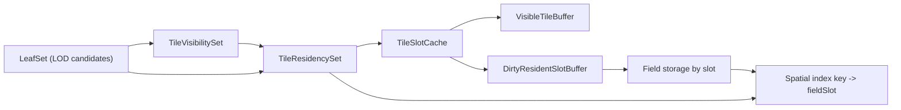

# Incremental GPU Updates Plan

## Purpose

The current compute path rewrites terrain GPU fields for every LOD-selected leaf
on each graph run. That is simple and correct, but it makes GPU compute cost
scale with broad quadtree leaf count even when most tiles are either unchanged
or outside the camera's view.

Incremental GPU updates should be combined with conservative tile visibility.
The target cost model is:

```txt
newly visible or invalid tiles * vertices per tile
```

not:

```txt
all LOD-selected leaves * vertices per tile
```

Rendering and query lookup still need a dense current-frame tile set, but that
set should be built from visible or near-visible leaves rather than every leaf
selected by the quadtree.

## Goals

- Reuse GPU terrain field data for tiles that remain visible across frames.
- Cull LOD-selected leaves with conservative frustum and horizon tests before
  terrain field compute.
- Dispatch elevation, normal, and tile-bounds compute over dirty visible slots
  only.
- Preserve the current projection model: no branching on projection kind in the
  pipeline; projection hooks continue to own shape-specific math.
- Treat `projection.kind` as metadata for diagnostics and telemetry only. Cache
  invalidation must use explicit topology/projection `cacheKey` identity. New
  behavior must be added through injected topology or projection hooks.
- Keep task-local state instance-scoped. Do not use module-scope caches.
- Keep first implementation conservative enough to verify against existing
  readback/query behavior.
- Expose enough GPU lab telemetry for agents to optimize the system: candidate
  count, visible count, frustum/horizon culled counts, dirty visible count, reuse
  count, evictions, dirty-visible ratio, and per-pass timings.

## Non-Goals

- No GPU-driven quadtree selection in the first milestone.
- No GPU occlusion queries or hierarchical-Z occlusion in the first milestone.
  Start with deterministic frustum culling and projection-provided horizon
  culling.
- No background streaming or disk cache in the first milestone.
- No change to the public elevation callback API.
- No attempt to make camera teleports cheap. A teleport may dirty most slots.

## Current Model

Today, `LeafSet` is both:

- the LOD-selected tile list for this frame,
- the storage identity for terrain compute outputs.

The important current relationships are:

- `quadtreeUpdateTask` produces a frame-local `LeafSet` for the broad terrain
  selection.
- `leafGpuBufferTask` uploads that list densely as records:
  `[level, x, y, space]`.
- `executeComputeTask` dispatches one tile instance per active leaf index.
- `elevationFieldStorage`, `terrainFieldStorage`, and `tileBounds` are addressed
  by that active leaf index.
- CPU and GPU spatial indexes map `(space, level, x, y)` to the same active leaf
  index.
- `TerrainMesh.frustumCulled` is disabled at the mesh level, and there is no
  per-tile visibility stage before terrain field compute.

This means a stable tile can move to a different active index when the leaf list
changes, so its previous GPU field data cannot be safely reused.

## Target Model

Split broad LOD selection, visibility, and persistent field storage.



In the target model:

- `candidateIndex` means "dense LOD-selected leaf index before culling."
- `visibleIndex` means "dense visible or guard-band tile index for this frame."
- `residentIndex` means "dense tile index that must have terrain data available
  for rendering, physics, raycasts, samplers, or other queries."
- `fieldSlot` means "stable slot containing GPU terrain field data for one tile
  key."
- Rendering iterates visible draw records.
- Compute writes `fieldSlot` for dirty resident slots.
- CPU/GPU spatial lookup returns `fieldSlot` for terrain field sampling.
- Frustum, horizon, and occlusion culling may remove tiles from the draw list,
  but they must not evict terrain data required by residency anchors.

The first implementation can keep broad quadtree selection CPU-driven. Culling is
not a replacement for LOD selection; it is a filter between LOD selection and
field compute/render upload.

## Tile Identity

Use a canonical tile key derived from the topology tile id:

```ts
type TileKey = {
  space: number;
  level: number;
  x: number;
  y: number;
};
```

The key should not include projection kind directly. Projection/topology identity
changes should invalidate or recreate the cache at the task level, because tile
coordinates may have different geometry semantics even if the numeric key shape
matches.

For string map keys, use a small helper such as:

```ts
function tileKeyString(space: number, level: number, x: number, y: number): string;
```

For packed numeric keys, handle signed `x`/`y` explicitly. Infinite flat terrain
uses signed coordinates, and high LOD levels can exceed small bit-packed ranges.

## New Runtime Entities

### TileVisibilityState

CPU-owned task-local state for the current frame's conservative visibility
filter.

Responsibilities:

- Treat `LeafSet` as candidate input, not as the render/compute set.
- Cull candidates against an expanded camera frustum.
- Cull candidates with projection-provided horizon/shape occlusion when the
  projection injects a conservative hook.
- Keep a guard band of near-visible tiles so small camera movements do not cause
  popping or constant cache churn.
- Emit the dense visible/guard tile list used by slot assignment.
- Report candidate, visible, guard, frustum-culled, horizon-culled, and unknown
  or unculled counts.

Suggested shape:

```ts
type TileVisibilityState = {
  generation: number;
  candidateCount: number;
  visibleCount: number;
  guardCount: number;
  frustumCulledCount: number;
  horizonCulledCount: number;
  visibleCandidateIndices: Uint32Array;
  visibilityState: Uint8Array;
};
```

`visibilityState` can begin as a small enum:

- `0`: visible draw tile
- `1`: guard-band tile
- `2`: frustum culled
- `3`: horizon/shape culled by an injected projection hook
- `4`: unculled because no conservative bounds are available

### TileResidencyState

CPU-owned task-local state for the current frame's terrain-data residency set.

Responsibilities:

- Include every visible/guard tile.
- Add non-visible tiles intersecting `UpdateParams.residency.anchors`.
- Keep gameplay/query/readback data independent from render visibility.
- Report visible-resident, anchor-resident, and total resident counts.

Suggested shape:

```ts
type TileResidencyState = {
  residentCandidateIndices: Uint32Array;
  residencyState: Uint8Array;
  residentCount: number;
  visibleResidentCount: number;
  anchorResidentCount: number;
};
```

### TileSlotCacheState

CPU-owned task-local state that persists across graph runs for one buffer shape.

Responsibilities:

- Map tile keys to stable field slots.
- Track slot tile metadata.
- Track which slots are render-visible this frame.
- Track which slots are resident for render/query/physics support.
- Track which slots are dirty and why.
- Reclaim slots no longer active after a configurable retention policy.

Suggested shape:

```ts
type TileSlotCacheState = {
  capacity: number;
  shapeKey: string;
  contentEpoch: number;
  generation: number;
  keyToSlot: Map<string, number>;
  slotKey: string[];
  slotContentEpoch: Uint32Array;
  slotSpace: Uint8Array;
  slotLevel: Uint8Array;
  slotX: Int32Array;
  slotY: Int32Array;
  slotState: Uint8Array;
  visibleSlots: Uint32Array;
  residentSlots: Uint32Array;
  dirtyResidentSlots: Uint32Array;
  visibleSlotCount: number;
  residentSlotCount: number;
  dirtyResidentCount: number;
  reusedCount: number;
  allocatedCount: number;
  evictedCount: number;
};
```

`slotState` can begin as a small enum:

- `0`: free
- `1`: resident
- `2`: dirty

### VisibleTileBufferState

GPU-uploaded dense visible draw list. It keeps rendering ergonomic while
allowing field data to live in another slot.

Initial record layout can be either:

- keep existing leaf storage `[level, x, y, space]`, plus a separate
  `visibleFieldSlotStorage`, or
- expand leaf storage to `[level, x, y, space, fieldSlot]`.

The first option is less disruptive for existing `decodeLeafTile` callers. The
second option reduces one buffer read in render/query shaders. The first
implementation should prefer less API churn unless profiling says otherwise.

### DirtyResidentSlotBufferState

GPU-uploaded list of resident field slots that need compute this run. The
current implementation may keep the legacy `dirtyVisible*` storage names while
the public API migrates, but the semantics are dirty-resident.

The compute pipeline dispatches over `dirtyResidentCount`, not candidate leaf
count.

Each dirty slot already has metadata in the slot tile storage, so the compute
kernel can recover tile coordinates from `fieldSlot`:

```ts
const dirtyIndex = global dispatch instance;
const fieldSlot = dirtyResidentSlotStorage[dirtyIndex];
const tile = slotTileStorage[fieldSlot];
```

### SlotTileStorage

GPU storage containing tile metadata by `fieldSlot`. This is the compute input
for dirty-resident-slot kernels.

Record layout should mirror the existing leaf record:

```ts
[level, x, y, space]
```

If visible leaf storage is later expanded to include `fieldSlot`, keep slot tile
storage separate anyway. Dirty-visible compute should not need visible draw
order.

## Visibility and Culling Plan

### Conservative Bounds

The visibility stage must not depend on computed terrain bounds, because its job
is to decide which terrain fields need to be computed. Use conservative analytic
bounds from topology metadata:

- Flat topology hooks provide tile plane bounds expanded by max elevation
  envelope.
- Cube-sphere topology hooks provide tile corner directions projected to the
  planet radius, plus max elevation envelope.
- Torus topology hooks provide conservative patch bounds; if unavailable, mark
  as unculled until the topology supplies a bound.

False positives are acceptable. False negatives are correctness bugs because
they can drop visible terrain.

Projection/topology hooks should own bound construction. The main pipeline should
ask for a tile visibility bound and run generic tests over that bound.
The main pipeline must not branch on `projection.kind` to choose bound or
occlusion behavior.

### Frustum Culling

CPU frustum culling is the first milestone. It should use the render camera's
view-projection matrix with a configurable guard band:

- Expand bounds by a small world-space or angular margin.
- Keep guard-band tiles resident and optionally precomputed.
- Render only visible draw tiles once the active/guard split exists.

The guard band is important for agent benchmarks. Without it, a tiny camera
change can turn culling into allocation churn and make results noisy.

### Horizon Culling

For earth-scale cube-sphere terrain, horizon culling is likely more valuable
than generic occlusion queries. A tile fully behind the planet horizon should not
need field compute or rendering.

Horizon culling is projection-specific. Shared visibility code should call an
optional projection CPU hook, such as `projection.cpu.isTileBehindHorizon(ctx)`,
and mark tiles unculled when no hook is present. It must not test
`projection.kind`, topology names, or built-in factory identities.

For the cube-sphere projection, the hook can implement a spherical occluder:

```ts
const cameraDistance = length(cameraFromCenter);
const cameraDir = cameraFromCenter / cameraDistance;
const maxTileProjection = dot(tileBound.centerFromCenter, cameraDir) + tileBound.radius;
const fullyBehindHorizon =
  cameraDistance * maxTileProjection < occluderRadius * occluderRadius;
```

Use an occluder radius that is conservative for elevated terrain. Starting with
the base planet radius, or base radius plus a known minimum elevation, avoids
culling peaks that may rise above the geometric horizon.

For torus or custom surfaces, leave horizon/shape occlusion disabled until the
projection can inject a conservative test for its own geometry.

### Generic Occlusion Culling

Do not start with WebGPU occlusion queries. They add history, latency, and
readback complexity, and terrain often needs itself as the occluder. Once
frustum, horizon, and dirty-visible updates are working, a later phase can
explore:

- GPU-generated visibility history for stable hidden tiles.
- Hi-Z depth pyramid tests from the previous frame.
- Parent tile occlusion proxies.

Those should remain optional accelerators. The core correctness path should be
deterministic frustum and horizon culling.

## Task Graph Changes

### New tasks

- `tileVisibilityTask`
  - Depends on `quadtreeUpdateTask` and camera/projection state.
  - Produces visible/guard candidate indices.
  - Reports candidate, visible, guard, frustum-culled, horizon/shape-culled,
    and unculled counts.

- `tileResidencyTask`
  - Depends on `tileVisibilityTask` and `quadtreeUpdate.residency`.
  - Produces resident candidate indices by unioning visible/guard tiles with
    anchor-intersecting support tiles.
  - Keeps physics/query terrain data alive when render visibility culls tiles.

- `terrainFieldContentEpochTask`
  - Depends on the topology task and every parameter that can change generated
    field values (`rootSize`, `origin`, `radius`, `innerTileSegments`,
    `elevationScale`, `elevationFn`).
  - Produces a monotonic numeric epoch by incrementing its previous value only
    when the `work` graph invalidates those dependencies.
  - Slot cache state stores this epoch per slot; the cache does not inspect or
    stringify field inputs itself.

- `tileSlotCacheTask`
  - Owns `TileSlotCacheState`.
  - Recreated when buffer shape or topology identity changes.

- `tileSlotUpdateTask`
  - Depends on `tileVisibilityTask` and `tileResidencyTask`.
  - Assigns resident leaves to field slots.
  - Produces visible, resident, dirty-resident, reuse, allocation, and eviction
    telemetry.

- `visibleTileBufferTask`
  - Uploads visible draw records and field-slot mapping.
  - Replaces or wraps current `leafGpuBufferTask` for render consumers.

- `dirtyResidentSlotBufferTask`
  - Uploads dirty resident field slots.
  - Compute execution depends on this.

- `slotTileStorageTask`
  - Allocates slot-addressed tile metadata.
  - Updated by `tileSlotUpdateTask` for allocated or metadata-changed slots.

### Existing task changes

- `leafGpuBufferTask`
  - Either becomes a compatibility wrapper over `visibleTileBufferTask`, or is
    renamed in a larger follow-up once the new model is stable.

- `createElevationFieldContextTask`
  - Capacity remains `maxNodes * verticesPerNode`.
  - Offsets become field-slot based rather than active-index based.

- `createTerrainFieldTextureTask`
  - Tile layer count remains capacity-based.
  - Sampling uses `fieldSlot`.

- `executeComputeTask`
  - Dispatches `dirtyVisibleCount`.
  - Uses dirty-visible-slot lookup to convert dispatch instance to `fieldSlot`.

- `tileBoundsReductionTask`
  - Dispatches `dirtyVisibleCount`.
  - Writes bounds at `fieldSlot * 2`.

- `gpuSpatialIndexUploadTask`
  - Uploads visible tile keys with values equal to `fieldSlot`.
  - This makes GPU lookup return field storage identity.

- `terrainReadbackTask`
  - Initially may read the full capacity-shaped field for correctness.
  - Later can read only visible or dirty ranges if Three/WebGPU readback support
    makes partial reads practical.

## Compute Pipeline Changes

The staged compute callback currently receives `nodeIndex`, which means active
leaf index in the current implementation. Introduce a field-slot execution path
without breaking custom stages immediately.

Recommended migration:

1. Add an internal compile option for slot-indirect dispatch:
   - `instanceSource: "active-index" | "dirty-visible-slot"`
   - default remains current behavior until standard terrain tasks opt in.

2. For `"dirty-visible-slot"`, compute pipeline derives:
   - `dispatchIndex` from global id,
   - `fieldSlot` from dirty-visible-slot storage,
   - tile metadata from slot tile storage,
   - `globalVertexIndex = fieldSlot * verticesPerNode + localVertexIndex`.

3. Keep existing stage callback shape initially:

```ts
type ComputeStageCallback = (
  nodeIndex: Node,
  globalVertexIndex: Node,
  uv: Node,
  localCoordinates: Node,
  texelSize: Node,
) => void;
```

In dirty-visible-slot mode, `nodeIndex` should be the field slot. Any stage that
needs tile metadata should read it through the injected tile compute helpers,
not from visible leaf storage.

4. Later, consider renaming the callback argument from `nodeIndex` to
`tileIndex` or `fieldSlot` only if the public custom-stage story needs it.

## Invalidation Rules

Start conservative. Prefer extra dirty work over stale terrain.

| Change | Action |
| --- | --- |
| Camera movement | Recompute visibility and residency; allocate/reuse slots for resident leaves; dirty only new or invalid slots |
| Camera orientation change | Recompute frustum visibility; reused visible slots stay clean |
| New tile enters visible or guard set | Allocate/reuse slot; mark slot dirty |
| New tile enters residency through an anchor | Allocate/reuse slot; mark slot dirty; include it in query/readback spatial indexes even if it is not visible |
| Tile remains visible with same key | Reuse slot; not dirty |
| Tile leaves visible set but remains resident | Keep slot active for compute/query; remove it from visible draw slots |
| Tile leaves residency set | Mark inactive; retain or free by policy |
| Frustum guard-band setting changes | Recompute visibility; newly admitted guard tiles are dirty if missing |
| Horizon culling setting or occluder envelope changes | Recompute visibility; field data stays valid unless topology/elevation inputs changed |
| Field content epoch changes (`elevationFn`, `elevationScale`, root geometry uniforms) | Keep slot identity, but mark every resident slot whose stored `slotContentEpoch` differs dirty; retained inactive slots dirty when they re-enter |
| `innerTileSegments` changes | Recreate field storage and slot cache |
| `maxNodes` changes | Recreate slot cache and GPU storage |
| `maxLevel` changes | Keep tile slots if capacity and topology identity are stable; recreate CPU query cache so range pyramids have the right capacity |
| `topology` or projection identity changes | Recreate slot cache and spatial indexes |
| `rootSize`, `origin`, `radius`, torus radii | Recreate or mark all resident slots dirty depending on topology identity behavior |
| `terrainFieldFilter` changes | Recreate terrain field texture only |

## Eviction Policy

First milestone:

- Free slots for inactive tiles immediately when capacity pressure appears.
- Otherwise retain inactive resident slots for reuse until the next pressure
  event.

This is simple and captures camera jitter wins. Later improvements can add:

- last-used generation,
- distance from camera,
- level-priority eviction,
- parent/child reuse hints.

## CPU Query and Snapshot Plan

The CPU snapshot must remain internally consistent:

- spatial index values should match the field slot used by elevation/bounds data,
- query sampling should read slot-addressed elevation data,
- tile metadata by slot must be captured with the same generation as field data.

First implementation:

- Keep full readback into capacity-shaped arrays.
- Add slot metadata arrays to `CpuTerrainCache` or its snapshot state.
- Change tile lookup naming from `leafIndex` to `fieldSlot` where the value is no
  longer active draw order.
- Preserve existing generation behavior so consumers know when snapshots update.

Follow-up optimization:

- Read back only resident slots or dirty-resident slots.
- Maintain CPU-side cached elevation/bounds for resident slots that were not
  dirty this frame.

## GPU Lab Plan

Add lab output:

```ts
terrain.incremental = {
  candidateCount,
  visibleCount,
  guardCount,
  frustumCulledCount,
  horizonCulledCount,
  dirtyVisibleCount,
  reusedCount,
  allocatedCount,
  evictedCount,
  visibleRatio,
  dirtyVisibleRatio,
};
```

Add scenarios:

- `earth-sphere-surface-drift`
  - `maxNodes=16384`
  - surface camera
  - small tangential camera motion
  - expected visible ratio and dirty-visible ratio after warmup: low

- `earth-sphere-surface-yaw`
  - surface camera
  - rotate across the horizon without large position movement
  - expected candidate count high, visible count much lower

- `earth-torus-surface-drift`
  - same purpose for torus periodic topology

- `earth-sphere-surface-teleport`
  - validates full dirty behavior remains correct
  - not expected to meet the 1.5ms steady-state budget

Budget assertions should distinguish:

- cold or teleport frames,
- warm steady-state drift frames.

Suggested first acceptance criteria:

- Cold frame remains correct and has no NaNs.
- Surface sphere scenarios report `visibleCount < candidateCount` with a
  meaningful margin once frustum/horizon culling is enabled.
- After warmup, drift scenarios report
  `dirtyVisibleCount < visibleCount * 0.25`.
- Steady-state 16k drift scenarios trend toward the 1.5ms compute budget.
- Existing 4096-node budget scenarios continue to pass.

## Implementation Phases

### Phase 1: CPU visibility and slot assignment telemetry

- Add topology-provided visibility bounds and a cube-sphere projection horizon
  hook first.
- Add `TileVisibilityState` and `tileVisibilityTask`.
- Add `TileSlotCacheState`.
- Add unit tests for stable assignment, reuse, capacity pressure, and invalidation.
- Add unit tests for conservative frustum and horizon culling.
- Add telemetry to the GPU lab without changing render or compute dispatch yet.

Exit criteria:

- Candidate, visible, culled, and dirty-visible counts are deterministic.
- Surface camera scenarios show candidate count materially larger than visible
  count.
- Small camera drift shows high visibility reuse.
- No render/query behavior changes.

### Phase 2: Visible storage plumbing

- Add slot tile metadata storage.
- Add visible-to-field-slot mapping.
- Change spatial index values to field slots.
- Update render and GPU sampler paths to sample by field slot.
- Keep compute full candidate/visible for this phase if needed.
- Render from the visible draw list once visual parity is proven.

Exit criteria:

- Existing visual/query/readback tests pass.
- GPU lab hashes and NaN checks remain stable.
- Rendered tiles match the conservative visibility set.

### Phase 3: Dirty-visible compute

- Add dirty-visible-slot dispatch mode for standard terrain compute.
- Change elevation and terrain field stages to write by field slot.
- Change tile bounds reduction to run over dirty-visible slots.
- Keep full readback for correctness.

Exit criteria:

- Per-pass GPU timing shows dispatch size follows `dirtyVisibleCount`.
- Budget drift scenarios pass or improve materially.
- Teleport scenarios remain correct.

### Phase 4: Snapshot/readback optimization

- Avoid full capacity readback when only a few visible slots are dirty.
- Preserve CPU cached data for clean resident slots.
- Update query generation semantics to describe mixed cached/readback snapshots.

Exit criteria:

- CPU query remains consistent across frames.
- Readback cost no longer dominates low-dirty-visible-ratio runs.

### Phase 5: Eviction and quality tuning

- Add retention controls if immediate capacity pressure eviction is too noisy.
- Add lab stress cases for camera jitter, rapid movement, and topology seams.
- Tune guard-band size against popping and dirty-visible churn.
- Consider a faster normal mode only after dirty-visible compute is proven.

### Phase 6: Optional occlusion accelerators

- Explore previous-frame Hi-Z or visibility history only after deterministic
  culling is stable.
- Keep occlusion history conservative: hidden history can skip precompute, but
  visible tests must recover quickly when the camera changes.

Exit criteria:

- Occlusion acceleration can be disabled without changing correctness.
- GPU lab reports occlusion-hidden counts separately from frustum/horizon counts.

## Risks

- **Index meaning confusion:** candidate index, visible index, and field slot
  must be named consistently. Prefer `candidateIndex`, `visibleIndex`, and
  `fieldSlot` in new code; avoid using `leafIndex` for field-slot values.
- **Snapshot consistency:** spatial index, slot metadata, elevation data, and
  bounds must belong to one logical snapshot generation.
- **Custom compute stages:** public stages may assume `nodeIndex` is an active
  leaf index. Keep compatibility until a migration path is explicit.
- **Culling false negatives:** conservative culling must never drop visible
  terrain. Start with false-positive-heavy bounds and tighten later.
- **Guard-band tuning:** too small causes popping/churn; too large erodes the
  compute savings.
- **Capacity pressure:** if `maxNodes` equals visible count, there may be little
  room to retain inactive slots. The system still helps stable visible tiles,
  but camera movement may evict aggressively.
- **Partial readback support:** optimized readback may require deeper renderer
  integration than the first milestone.
- **Occlusion-query latency:** generic occlusion should remain a later optional
  accelerator, not the first correctness path.

## Resolved Design Decisions

- Horizon/shape occlusion lives behind projection CPU hooks. The core visibility
  stage may provide generic helper functions, but it must not branch on
  `projection.kind` to decide which helper to run.

## Open Questions

- Should visible leaf storage expand to include `fieldSlot`, or should
  `visibleFieldSlotStorage` stay separate?
- Should `maxNodes` mean candidate tile capacity, visible tile capacity, field
  slot capacity, or a shared cap?
- Do custom compute stages need a new callback signature before
  dirty-visible-slot mode is exposed publicly?
- What retention policy best matches real camera movement in the docs app?
- Can tile bounds be made incremental before CPU query readback is incremental?
- What guard-band heuristic works best for surface flight: angular margin,
  screen-space margin, or time-to-visible prediction?

## Recommended First PR

Implement Phase 1 only:

- Conservative cube-sphere tile visibility bounds.
- `TileVisibilityState` and `tileVisibilityTask`.
- `TileSlotCacheState` plus pure helper functions.
- Unit tests over visibility, tile keys, and capacity behavior.
- GPU lab telemetry using the existing full compute path.
- No shader or render path changes.

That first PR gives agents measurable `visibleRatio` and `dirtyVisibleRatio`
targets before changing the storage contract. Once culling and reuse are visible
and stable, Phase 2 and Phase 3 can land with much lower risk.
