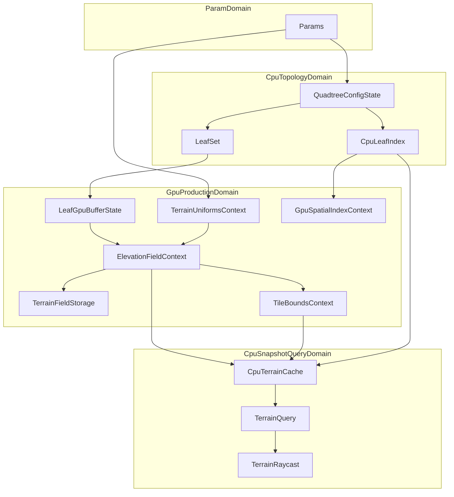

# Terrain Data Model

This document defines the canonical runtime data model for `@hello-terrain/three`:

- what core data entities exist,
- where each entity is owned (app, graph, CPU, GPU),
- how entities move across the pipeline,
- which entities are stable identities vs frame-updated payloads.

## Modeling Goals

- Keep ownership boundaries explicit.
- Make cross-frame state easy to reason about.
- Clarify which data is authoritative at each stage.
- Support both render and query/raycast consumers from one pipeline.

## Data Domains

The terrain system spans four data domains:

1. **Param domain (graph inputs)**
   - App-provided values and callbacks (`rootSize`, `origin`, `maxNodes`, `elevationFn`, etc.).
   - Primary invalidation drivers.

2. **CPU topology domain (quadtree)**
   - Active tile topology and lookup structures.
   - Authoritative source of tile identity each frame.

3. **GPU production domain (compute + textures/buffers)**
   - Elevation, derived terrain field, and reduction outputs.
   - Authoritative source of render-time geometric payloads.

4. **CPU snapshot/query domain**
   - Async readback snapshots for synchronous gameplay queries and raycasts.
   - Eventually consistent with GPU production.

## Core Entities

### 1) Params (graph inputs)

Defined in `packages/three/src/tasks/params.ts`.

- **World config:** `rootSize`, `origin`, `elevationScale` (+ the deprecated `radius`)
- **Shape config:** `innerTileSegments`, `maxNodes`, `maxLevel`
- **Runtime controls:** `quadtreeUpdate`, `terrainFieldFilter`
- **Customization callbacks:** `topology`, `elevationFn`

These values are not copied into one monolithic config object; they are consumed directly by task dependencies.

**World-config ownership.** `rootSize`, `origin`, and `radius` have a single
owner: the resolved `Topology` (`topologyTask`). The default flat topology is
built *from* the `rootSize` / `origin` params; a custom topology carries its own
`rootSize` / `origin` and `projection.radius`. Every consumer (`createUniformsTask`,
`updateUniformsTask`, `terrainQueryTask`, `terrainRaycastTask`) resolves the
effective values through `resolveTerrainWorldConfig(topology, params)` —
topology first, params as fallback — so the GPU uniforms and the CPU LOD/query/
raycast can never disagree. The `radius` param is deprecated and only a fallback.

### 2) QuadtreeConfigState

Defined in `packages/three/src/tasks/graph.types.ts`.

- `state: QuadtreeState`
- `topology: Topology`

`QuadtreeState` owns:

- node store / traversal scratch,
- `LeafSet` working buffers,
- authoritative CPU `leafIndex` spatial index.

### 3) LeafSet and Leaf GPU Buffer

- `LeafSet` is frame-local CPU output from `quadtreeUpdateTask`.
- `LeafGpuBufferState` is GPU buffer-backed storage plus active `count`.

The CPU `LeafSet` is the source of truth for which tiles are active this frame; the GPU leaf buffer is a transport/materialization for downstream GPU work.

### 4) TerrainUniformsContext

Allocated once, updated each run:

- `createUniformsTask` creates stable node identities,
- `updateUniformsTask` mutates live values.

Downstream tasks depend on `updateUniformsTask` so ordering is explicit.

### 5) ElevationFieldContext

Storage buffer context for per-vertex raw heights:

- `data: Float32Array`
- `attribute: StorageBufferAttribute`
- `node: StorageBufferNode`

Written by compute stage (`elevationFieldStageTask`).

### 6) TerrainFieldStorage

Texture-backed terrain payload (RGBA = `[normalizedHeight, Nx, Ny, Nz]`) consumed by render and GPU sampler paths. The `.r` channel stores per-tile normalized elevation in `[0, 1]` (see `TileBoundsContext` pack bounds); absolute meters are restored at sample time before `elevationScale` is applied. Normals are unit world-space vectors.

### 7) GpuSpatialIndexContext

GPU spatial index representation used for shader-side world->tile lookup.

### 8) TileBoundsContext

GPU elevation bounds per active tile, produced by reduction after the elevation compute stage and before terrain-field pack. Each tile occupies four floats:

- `[0]` `lodMin`, `[1]` `lodMax` — inner vertices only (skirts excluded; used for LOD and CPU readback)
- `[2]` `packMin`, `[3]` `packMax` — all vertices (used to normalize/denormalize terrain-field `.r`)

### 9) TerrainQueryContext

CPU query facade and backing cache:

- `cache: CpuTerrainCache`
- `query: TerrainQuery`
- `shapeKey: string` (buffer-shape identity; a change recreates the cache)
- `projection: SurfaceProjection` (the projection the queries close over; an identity change — any surface-geometry change — swaps surface ops + rebuilds queries)

This is the authoritative CPU query entrypoint for app/raycast usage.

### 10) TerrainRaycast

Raycast adapter over `TerrainQuery`, produced by `terrainRaycastTask`.

- Scoped to task instance state (not module-global singleton state).
- Carries current bounds/config through task-local state updates.

## Identity vs Payload Rules

To avoid accidental rebuild churn:

- **Stable identity objects** should be allocated once per shape key (or once lifetime):
  - uniform node objects,
  - long-lived storage contexts keyed by capacity/shape.
- **Payload fields** should be updated per frame:
  - uniform values,
  - leaf counts,
  - compute/readback outputs.

In practice:

- `create*Task` usually establishes identity/lifecycle.
- `update*Task` or stage/sink tasks mutate payload.

## Data Relationships

## Consistency Model

### Render path

- Uses current-frame GPU resources directly.
- Lowest latency, authoritative for visual output.

### Query path

- Uses async snapshots (`CpuTerrainCache`) populated by readback.
- Potentially stale by one or more frames.
- Exposes generation tracking to allow consumers to react to freshness.

## Snapshot Contract (Spatial Index)

`CpuTerrainCache` clones the CPU spatial index before scheduling async readback to guarantee that:

- elevation/bounds payload and tile index mapping belong to the same logical snapshot,
- later quadtree mutations do not invalidate an in-flight query snapshot.

This clone is intentional correctness protection, not incidental duplication.

### CPU Query Module Layout

`CpuTerrainCache` (`query/cpu-terrain-cache.ts`) is an assembler over focused modules:

- `query/terrain-snapshot.ts`: double-buffered snapshot state plus the readback/swap lifecycle (owns the spatial-index clone above).
- `query/tile-lookup.ts`: coarse-to-fine flat / face-UV / direction tile lookups against a snapshot index. CPU mirror of the TSL lookups in `query/gpuSpatialIndex.ts`.
- `query/elevation-field-sampling.ts`: plain-number grid reads, bilinear sampling, and the shared central-difference elevation gradient. CPU mirror of the TSL normal derivation in `tasks/terrain-field.task.ts`.

CPU/TSL mirror pairs are never merged across the boundary; they are co-located or cross-referenced (`Mirrors:` comments) with shared scalar constants in `gpu/tile.ts`.

## Task-Model Mapping (Canonical)

- **Topology producer:** `quadtreeConfigTask`, `quadtreeUpdateTask`
- **GPU upload/materialization:** `leafGpuBufferTask`, `gpuSpatialIndexUploadTask`
- **Uniform lifecycle:** `createUniformsTask`, `updateUniformsTask`
- **Compute production:** `elevationFieldStageTask`, `terrainFieldStageTask`, `executeComputeTask`
- **Reduction/readback:** `tileBoundsReductionTask`, `terrainReadbackTask`
- **CPU consumption:** `terrainQueryTask`, `terrainRaycastTask`
- **Render node output:** `positionNodeTask`

## Consumer Guidance

- Use `positionNodeTask` + `quadtreeUpdateTask.count` for rendering.
- Use `terrainQueryTask.query` for CPU terrain sampling APIs.
- Use `terrainRaycastTask` for scene picking integration.
- Treat query data as snapshot-based and generation-driven rather than immediate GPU truth.
