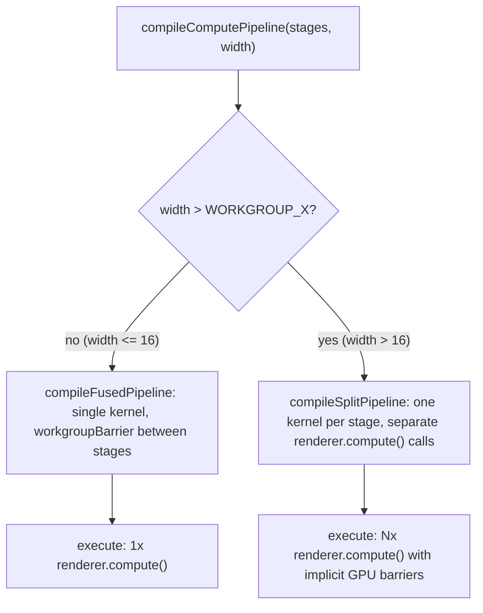

# Split Compute Dispatches for Large Tiles

## Problem

When `innerSegments > 13` (edgeVertexCount > 16), the 17x17 vertex grid requires multiple 16x16 workgroups per tile. The `workgroupBarrier()` between the heightmap and normalmap stages only synchronizes within a workgroup, so the normalmap stage can read stale heightmap values written by a neighboring workgroup.

## Approach

All changes are confined to a single file: [packages/three/src/compute/gpu.ts](packages/three/src/compute/gpu.ts). The change is transparent to all callers -- the `compileComputePipeline` return type stays the same.




## Implementation

Refactor `compileComputePipeline` into a router that delegates to one of two internal functions:

- `**compileFusedPipeline**` -- the current implementation, unchanged. All stages in a single kernel with `workgroupBarrier()` between them. Used when `width <= WORKGROUP_X && width <= WORKGROUP_Y`.
- `**compileSplitPipeline**` -- new. Compiles each stage callback as its own compute kernel. The `execute` function dispatches them sequentially via separate `renderer.compute()` calls. WebGPU guarantees an implicit storage buffer barrier between dispatches.

Key details for `compileSplitPipeline`:

- Share a single `uInstanceCount` uniform across all kernels (same `UniformNode` referenced in each `Fn` closure, so the renderer binds the same GPU buffer)
- Each kernel gets the same workgroup size (16x16) and dispatch dimensions
- Each kernel has its own bounds check and stage invocation -- structurally identical to the fused kernel but with only one stage per kernel and no `workgroupBarrier()`
- The `execute` function loops over the compiled kernels and calls `renderer.compute()` for each

```ts
// Pseudocode for the split path
function compileSplitPipeline(stages, width, bindings) {
  const uInstanceCount = uniform(0, "uint");
  const kernels = stages.map(stage =>
    Fn(() => {
      // same preamble as fused kernel (globalId, bounds check, etc.)
      If(inBounds, () => {
        stage(nodeIndex, globalIndex, localUVCoords, localCoordinates, texelSize);
      });
    })().computeKernel(workgroupSize)
  );

  return {
    execute(renderer, instanceCount) {
      uInstanceCount.value = instanceCount;
      for (const kernel of kernels) {
        renderer.compute(kernel, [dispatchX, dispatchY, instanceCount]);
      }
    }
  };
}
```

## What does NOT change

- `ComputePipeline` type stays `ComputeStageCallback[]`
- `compileComputeTask`, `executeComputeTask`, `createComputePipelineTasks` -- unchanged
- `heightmapStageTask`, `normalmapStageTask` -- unchanged
- The scene file -- unchanged
- The accumulation pattern for user-extensible pipelines -- unchanged

